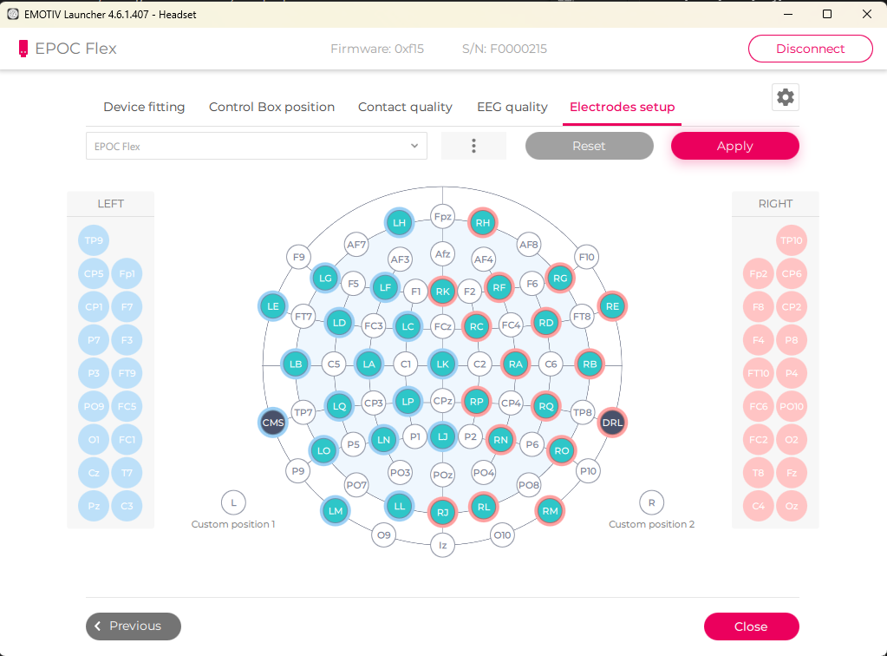
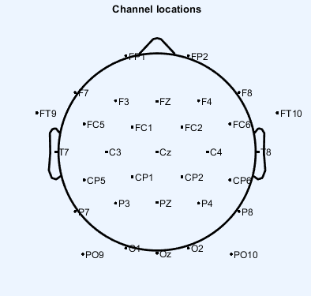
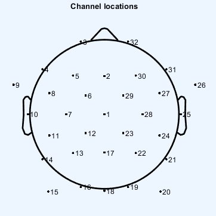
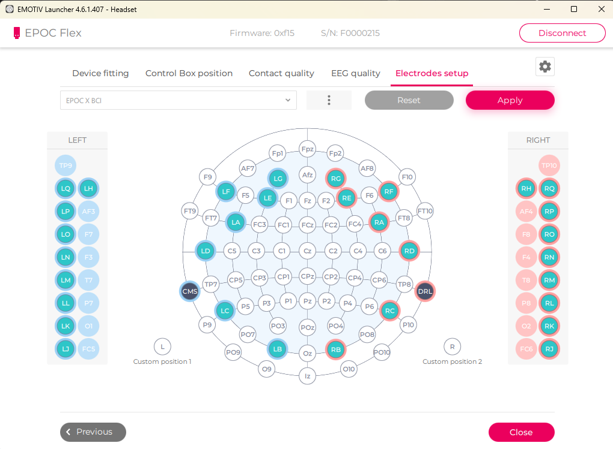

## Requirement
- This example works with Python >= 3.7
- Install websocket client via  `pip install websocket-client`
- Install python-dispatch via `pip install python-dispatch`

## Before you start

To run the existing example you will need to do a few things.

1. You will need an EMOTIV headset.  You can purchase a headset in our [online
   store](https://www.emotiv.com/)
2. Next, [download and install](https://www.emotiv.com/developer/) the Cortex
   service.  Please note that currently, the Cortex service is only available
   for Windows and macOS.
3. We have updated our Terms of Use, Privacy Policy and EULA to comply with
   GDPR. Please login via the EMOTIV Launcher to read and accept our latest policies
   in order to proceed using the following examples.
4. Next, to get a client id and a client secret, you must connect to your
   Emotiv account on
   [emotiv.com](https://www.emotiv.com/my-account/cortex-apps/) and create a
   Cortex app. If you don't have a EmotivID, you can [register
   here](https://id.emotivcloud.com/eoidc/account/registration/).
5. Then, if you have not already, you will need to login with your Emotiv id in
   the EMOTIV Launcher.
6. Finally, the first time you run these examples, you also need to authorize
   them in the EMOTIV Launcher.

This code is purely an example of how to work with Cortex.  We strongly
recommend adjusting the code to your purposes.

## Cortex Library
- [`cortex.py`](./cortex.py) - the wrapper lib around EMOTIV Cortex API.

## Susbcribe Data
- [`sub_data.py`](./sub_data.py) shows data streaming from Cortex: EEG, motion, band power and Performance Metrics.
- For more details https://emotiv.gitbook.io/cortex-api/data-subscription

## Create record and export to file
- [`record.py`](./record.py) shows how to create record and export data to CSV or EDF format.
- For more details https://emotiv.gitbook.io/cortex-api/records

## Inject marker while recording
- [`marker.py`](./marker.py) shows how to inject marker during a recording.
- For more details https://emotiv.gitbook.io/cortex-api/markers

## EEG data stream labels for EPOC Flex
{'streamName': 'eeg', 'labels': ['COUNTER', 'INTERPOLATED', 'Cz', 'Fz', 'Fp1', 'F7', 'F3', 'FC1', 'C3', 'FC5', 'FT9', 'T7', 'CP5', 'CP1', 'P3', 'P7', 'PO9', 'O1', 'Pz', 'Oz', 'O2', 'PO10', 'P8', 'P4', 'CP2', 'CP6', 'T8', 'FT10', 'FC6', 'C4', 'FC2', 'F4', 'F8', 'Fp2', 'HighBitFlex', 'SaturationFlag', 'RAW_CQ', 'MARKER_HARDWARE']}  

## NOTES: Performance metrics

- met labels are : ['attention.isActive', 'attention', 'eng.isActive', 'eng', 'exc.isActive', 'exc', 'lex', 'str.isActive', 'str', 'rel.isActive', 'rel', 'int.isActive', 'int']

- Performance metrics has very low sample rate (i.e., 2 if the license contains the scope "pm" and you activate the session before you subscribe; and 0.1 otherwise (1 sample every 10 seconds)). These provided measures are not applicable for this project.

- EPOC Flex requires re-configuration of electrods (following EPOC X electrode set up). This is a hassle.

-----------------------------------------
## Cortex App credentials
App name: anhtn-BCI-1
your_app_client_id = 'GSOo45bslMJwYoR43a3QCiRiaslR4rKAk7vUSWtL'
your_app_client_secret = '7XrypYmsVO76smVIsB8KstreTTv1mKc6BQ7iqVgnYJ7r2e8GwlnQCbRnTl2oZ8W9WY1Lo0716H2cQznaZasvQW2g1spuEehZ1ZhEJ23Cj6KNmYztAhO7qUNOb1mwJvDU'

