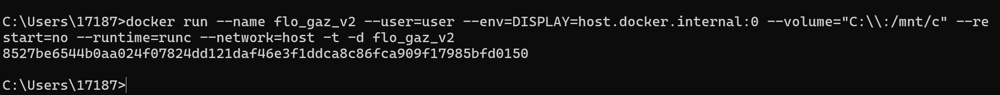
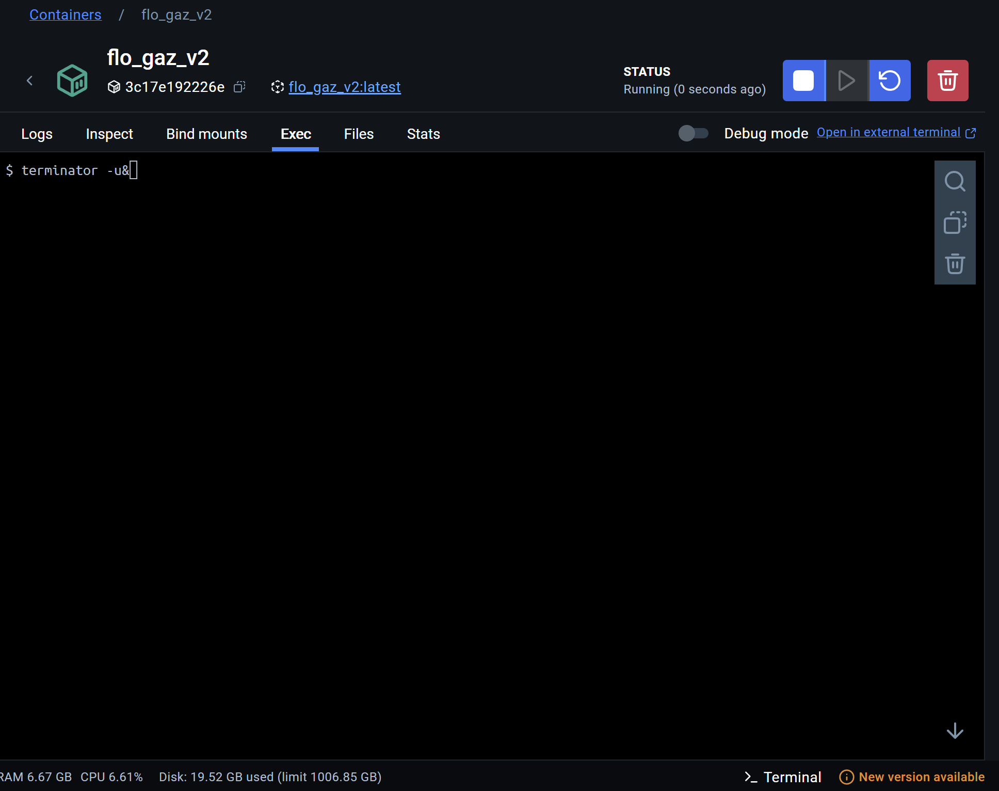
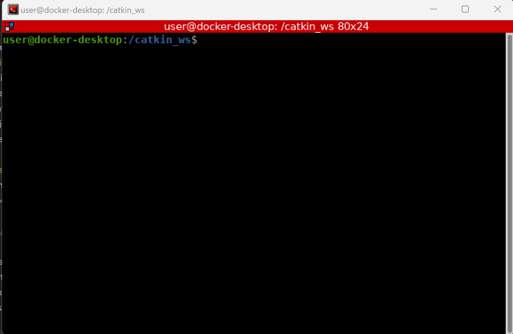

## Flo V2 Quickstart Instructions(Tian)

### 1. Build & Run Docker

---

Run the script to build the Docker image and start a new container:

```bash
 ./run_docker.sh
```

This removes any old container named flo_v2_container, builds flo_v2_image, and runs it.

### 2. Run a Demo Action

---

Inside the Docker container, launch the robot demo with a specific action number:

```bash
./run_a_demo.sh
```

It will ask you to enter the number.

This starts all necessary ROS nodes and executes action #1.

### 3. Run Additional Actions

---

If you’d like to run another action without restarting everything, just type:

```bash
rosrun movewithhead run_a_demo.py <action_number>
```

Example:

```bash
rosrun movewithhead run_a_demo.py 2
```

This sends action #2 to the robot.

Done!

## gazebo_simulation_and_control(From Hao)

This directory contains subdirectories and packages related to the simulation and control of Flo V2.

### camera

This folder contains the camera model and the code required to create and integrate the camera into the simulation environment.

### flo_humanoid

This package includes the motor control code. All motor angles must be transmitted to the robot using the code in this package.

### flov2withhead

This package contains the URDF model of the Flo V2 robot. Use this URDF file for simulation purposes.

### movewithhead

This package contains the motion control code, which serves as the core of the control program. Key functionalities include:

- Complete motion control code.
- Generating the workspace for the robotic arm.

---

## ROS Version

The code and packages are compatible with **ROS Noetic**.

---

## Usage Instructions

1. Clone this repository into the `src` folder of your ROS workspace:

   ```bash
   cd ~/your_workspace/src
   git clone <repository_url>
   ```
2. Navigate to your workspace root and build the packages:

   ```bash
   cd ~/your_workspace
   catkin_make
   ```
3. Source your workspace before running the simulation:

   ```bash
   source devel/setup.bash
   ```

---

## Docker Built in Windows

1. Ensure you have installed Docker extension in VS code. Right click the **Dockerfile**, select build image, enter a name you want.
2. Install Docker Desktop, check if this image exist
3. Open a terminal and type the following command. (Don't forget to change the name of the image you created)

   ```
   docker run --name your_container_name --user=user --env DISPLAY=host.docker.internal:0 --env QT_X11_NO_MITSHM=1 --volume="C:/:/mnt/c" --volume="/tmp/.X11-unix:/tmp/.X11-unix:rw" --device=/dev/ttyACM0 --privileged --restart=no --runtime=runc -p 1883:1883 -t -d your_img_name
   ```
4. If successed, you will see windows like:

   
5. Now the container should run on the windows, you can check it in Docker Desktop:
6. Install Xming from this website [https://sourceforge.net/projects/xming/]()
7. In the Docker Desktop, enter the running container, use **Exec** windows, run:

   ```
   terminator -u&
   ```

   
8. You will see Linux terminal like this:
   

### Note: 
To properly use the created docker container, run Xming first, then start the docker container. Run `terminator -u&` should pop up CLI terminal window on Windows.

## Test MQTT on 1 Windows PC

1. After run the container, **in the container** directly run `$ . run_a_demo_outside.sh `, keep the container running
2. **In the Windows,** go to \Flo_Project\FloSystemV2\cortex-example\python, run the `send_mqtt2docker.py`, enter the pose number you want (e.g. "1")
3. Now you can see the container running the pose

## Notes

- Ensure that **ROS Noetic** is installed and properly configured.
- The `movewithhead` package contains the core control program for Flo V2.
- Camera models are located in the `camera` folder for integration.

---

# Run robot control stuffs (on RViz + Gazebo simulation)

## Prerequisites:

```
sudo apt install mosquitto mosquitto-clients
pip install paho-mqtt
```

## Run full DS execution demo:

1. Create `~/catkin_ws` workspace and `~/catkin_ws/src` folder

2. Inside `src`, clone this repo

3. Install dependency: `sudo apt install ros-noetic-dynamixel-sdk ros-noetic-dynamixel-sdk-examples`

4. `cd ~/catkin_ws` then `catkin_make`. Make sure the packages are succesfully built.

5. `source devel/setup.bash`

6. `roslaunch movewithhead full_robot_arm_sim_with_ds.launch`

7. Open new terminal and `source devel/setup.bash`. Run `chmod +x src/<...>/gazebo_simulation_and_control/movewithhead/script/dualPosition.py` then run `rosrun movewithhead script/dualPosition.py`

(optional) Use simulated modulation input modeled as a sine wave:  Open new terminal and `source devel/setup.bash`. Run `chmod +x src/<...>/gazebo_simulation_and_control/movewithhead/script/modulation_input_publisher.py`. Run `rosrun movewithhead script/modulation_input_publisher.py`.
Open a new terminal and `source devel/setup.bash`. Run `rosrun rqt_plot rqt_plot /modulation_input` to plot the modulation input value

8. Open new terminal and `source devel/setup.bash`. Run `chmod +x src/<...>/gazebo_simulation_and_control/movewithhead/script/moveit_ds_modulation_executor.py` then run `rosrun movewithhead script/moveit_ds_modulation_executor.py`

9. Open new terminal and `source devel/setup.bash`. Run `chmod +x src/<...>/gazebo_simulation_and_control/movewithhead/script/run_a_demo.py` and run `ython src/<...>/gazebo_simulation_and_control/movewithhead/script/run_a_demo.py 1` to run action 1 (waving)

OR after step 4, open `gazebo_simulation_and_control` folder inside `src` then run:
```
chmod +x run_full_demo.sh
./run_full_demo.sh
```
which will execute all the steps from 5 to end.


---

## Docker Built in Windows

1. Ensure you have installed Docker extension in VS code. Right click the **Dockerfile**, select build image, enter a name you want.
2. Install Docker Desktop, check if this image exist
3. Open a terminal and type the following command. (Don't forget to change the name of the image you created)

   ```
   docker run --name your_container_name --user=user --env DISPLAY=host.docker.internal:0 --env QT_X11_NO_MITSHM=1 --volume="C:/:/mnt/c" --volume="/tmp/.X11-unix:/tmp/.X11-unix:rw" --device=/dev/ttyACM0 --privileged --restart=no --runtime=runc -p 1883:1883 -t -d your_img_name
   ```
4. If successed, you will see windows like:

   
5. Now the container should run on the windows, you can check it in Docker Desktop:
6. Install Xming from this website [https://sourceforge.net/projects/xming/]()
7. In the Docker Desktop, enter the running container, use **Exec** windows, run:

   ```
   terminator -u&
   ```

   
8. You will see Linux terminal like this:
   